## COMP1510TermProject

## Your name:

Jason Chow

## Your student number:

A00942129

## Your GitHub username:

Beijzum

## Instructions

- Best played in Terminal due to the clear() function.
- 1 , 2, 3, 4 are directions to move, and 5 shows the map.
- 6 shows the character's stats, and 7 shows the character's inventory.
- 8 saves the game, and 0 returns to the start menu
- You can visit the shop in the middle of the map to buy items and abilities.
- Enemies get stronger after the first two bosses!
- You can run away from a fight.
- You can use abilities and items.

## Spoilers! Quick walkthrough:

- First, you need to collect 2 special items from the top right corner and bottom left corner of the map.
- You can take these 2 special items to the bottom right area of the map.
- You will fight two more bosses and grab their equipment.
- The Final Boss room is in the bottom right. However, you need 2 special equipment to fight it.
- You can get these 2 special equipment from the top left and bottom right corners of the map.
- Good luck!

## Requirements:

| Requirement               | Where to find                                                                    |
|---------------------------|:---------------------------------------------------------------------------------|
| 5x5 Grid Map              | 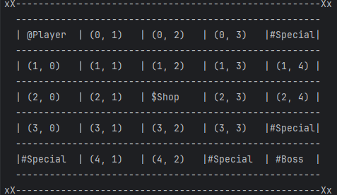 show_map() in exploration.py             |
| Character Dictionary      | 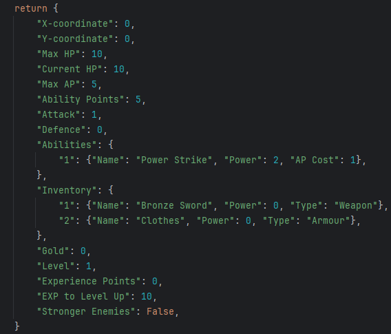 make_character() in character.py         |
| Character Movement        | 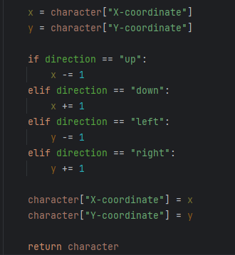 move_character() in exploration.py       |
| Encounter Challenges      | 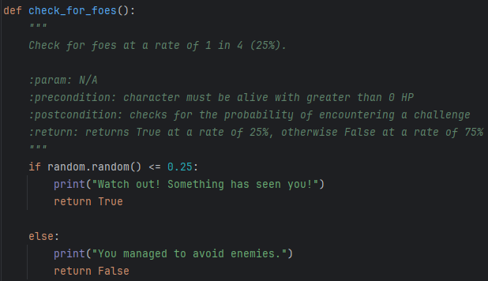 check_for_foes() in enemy.py             |
| Overcome Challenges       | 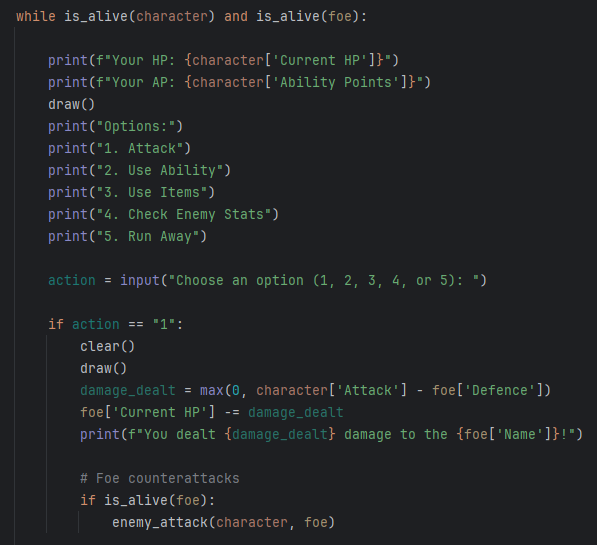 combat_loop() in game().                 |
| Goal Achieved = Game Ends | 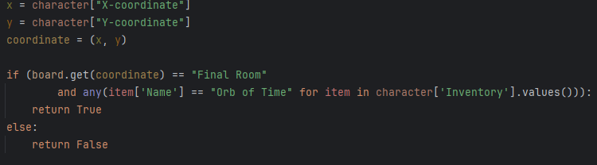 check_win_condition() in exploration.py. |
| Leveling System           | 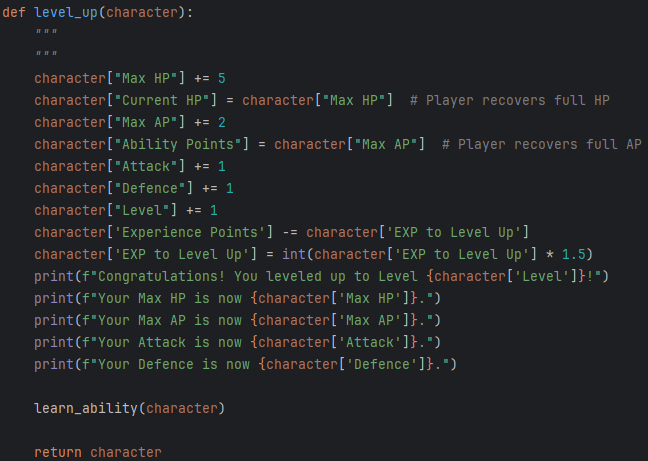 level_up() in character.py               |
| Leveling Details          | 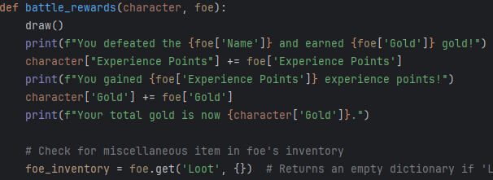 battle_rewards() in loot.py            |
| Leveling Stats            |  level_up() in character.py               |
| Final Boss                | 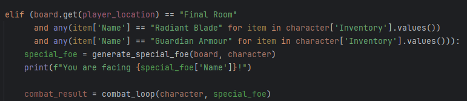 game() in game.py                      |
| Stronger Enemies          | 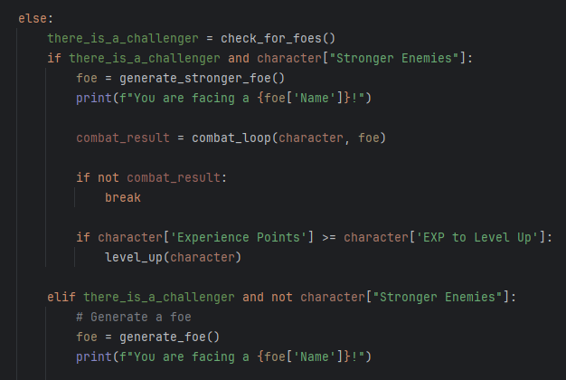 game() in game.py                      |
| Game Over                 | 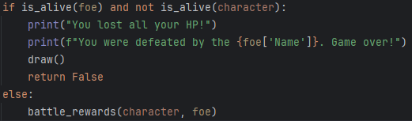 combat_loop() in game.py               |
| Immutable Data Structures | 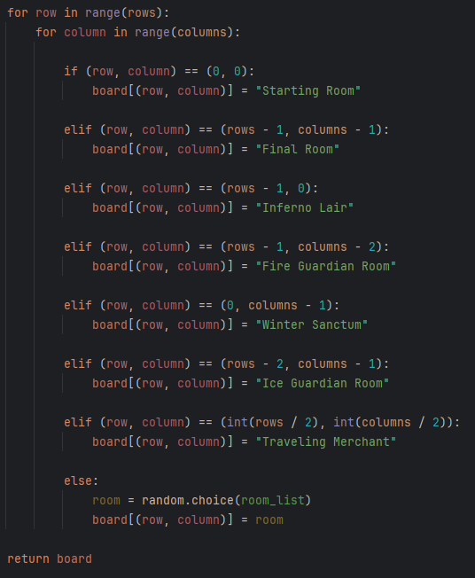 make_board() in exploration.py           |
| Mutable Data Structures   | 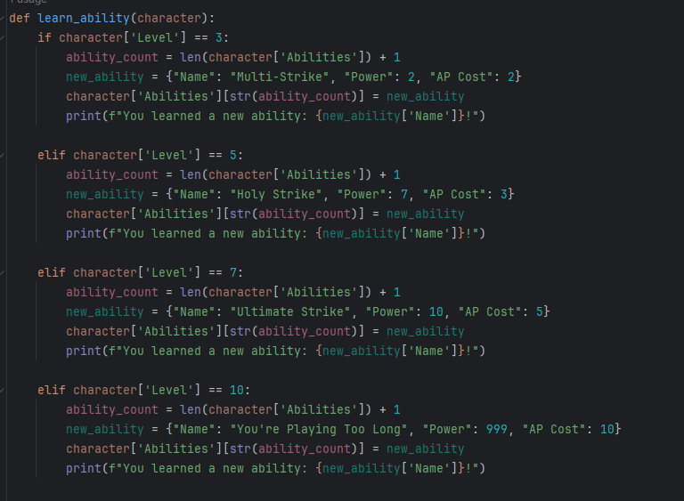 learn_ability() in character.py              |
| Handling Exception Errors | 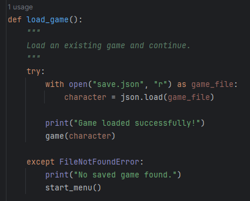 load_game() in game.py                   |
| Minimized Scope, Objects  |  make_character() in character.py         |
| Atomic Functions          | 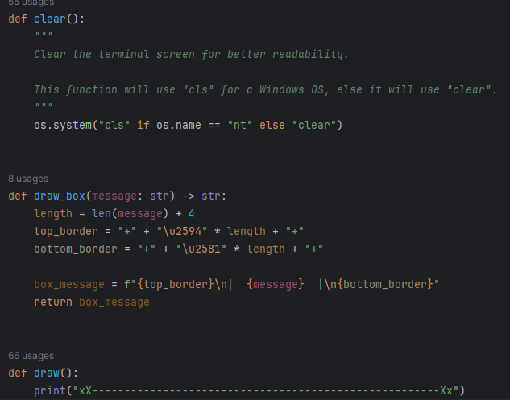 utility.py                             |
| Simple Flat Code          | 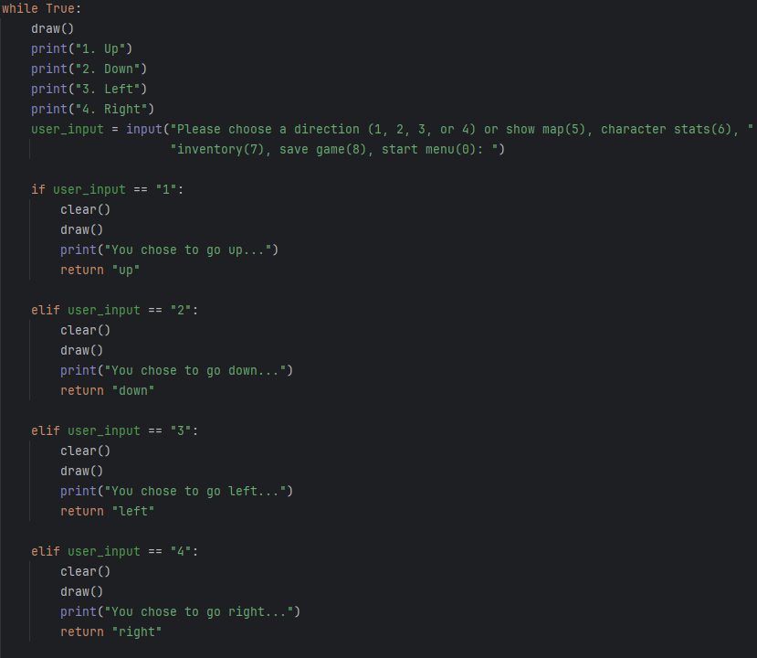 get_user_choice() in game.py           |
| Dictionary Comprehension  | 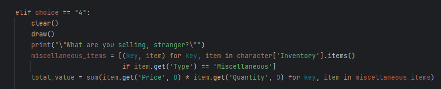 visit_shop() in loot.py                |
| if-elif-else Statements   |  get_user_choice() in game.py           |
| while-loop                | 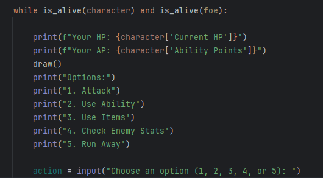 combat_loop() in game.py               |
| Membership Operator       | 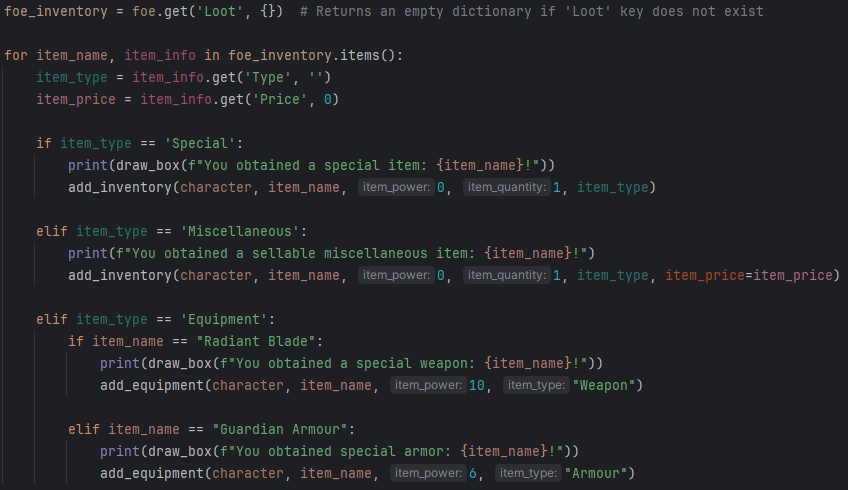 battle_rewards() in loot.py            |
| Range Function            |  make_board() in exploration.py           |
| Itertools                 | 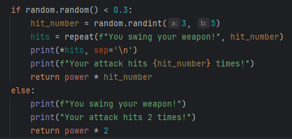 multi_strike() in combat.py            |
| Random Module             |  check_for_foes() in enemy.py             |
| Function Annotations      |  draw_box() in utility.py               |
| Doctests & Unit Tests     | 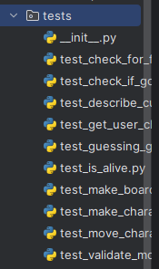 Tests folder                           |
| F-string Usage            | 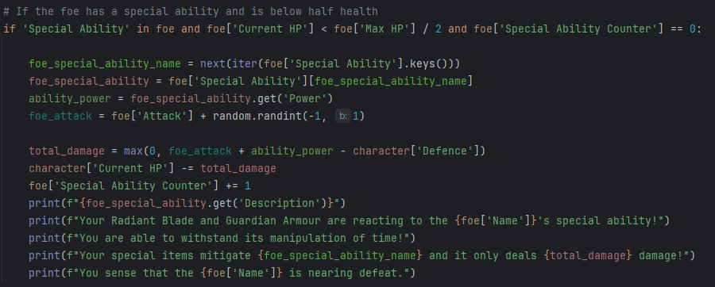 enemy_attack() in combat.py            |        

## Notes:

Tests not done on the following:

- start_game(): I don't know how to test this function because it has many other function calls inside it.
- save_game(): Testing it saves an actual JSON file, which is not ideal for testing.
- load_game(): I don't know how to mock a JSON file, so I can't test this function.
- game(): It is too complicated to test due to the large amount of decisions and function calls.
- combat_loop(): It is too complicated to test due to the large amount of decisions and function calls.
- visit_shop(): It is too complicated to test due to the large amount of decisions and function calls.