## COMP1510TermProject

## Your name:

Jason Chow

## Your student number:

A00942129

## Your GitHub username:

Beijzum

## Instructions

Best played in Terminal due to the clear() function.

## Requirements:

| Requirement               | Where to find                                                                           |
|---------------------------|-----------------------------------------------------------------------------------------|
| 5x5 Grid Map              | 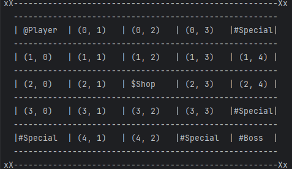 show_map()                                                  |
| Character Dictionary      | 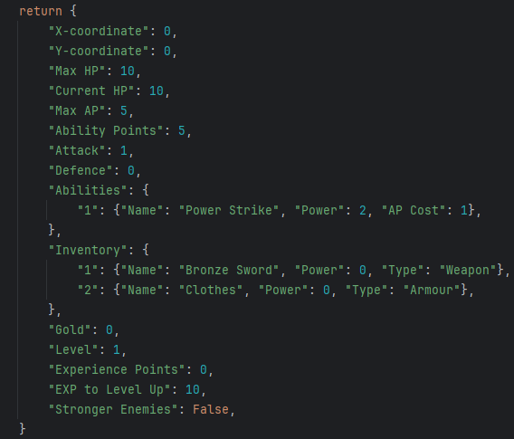 create_character()                                          |
| Character Movement        | 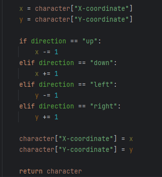 move_character()                                            |
| Encounter Challenges      |  Check for foes.                                             |
| Overcome Challenges       | 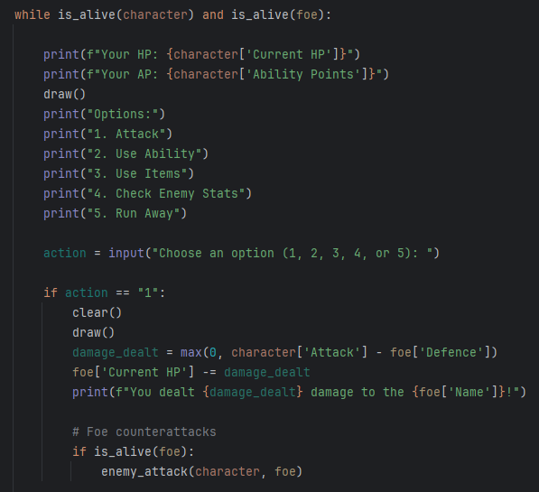 Small snippet of combat_loop. Can use abilities and items.  |
| Goal Achieved = Game Ends | 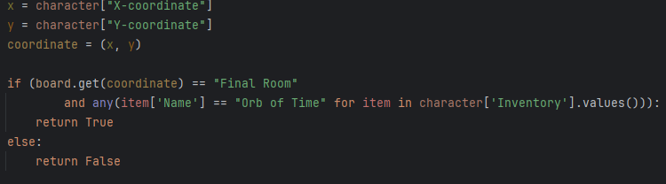 check_win_condition has two checks. Item and location.      |
| Leveling System           | 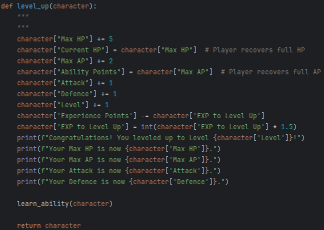 Player can level up and gain abilities.                     |
| Leveling Details          |  Players level up numerically. Enemies give exp.           |
| Leveling Stats            |  Players gain stats and abilities every level up.            |
| Final Boss                | 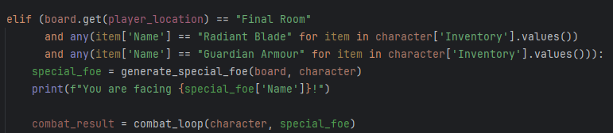 2 special items needed to fight the boss. game()          |
| Stronger Enemies          | 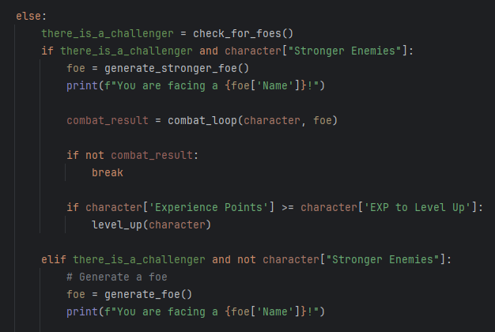 Enemies get stronger when an event is triggered. game()   |
| Game Over                 | 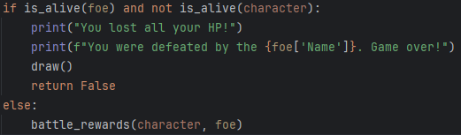 Game over when character HP is 0 or less. combat_loop()   |
| Immutable Data Structures | 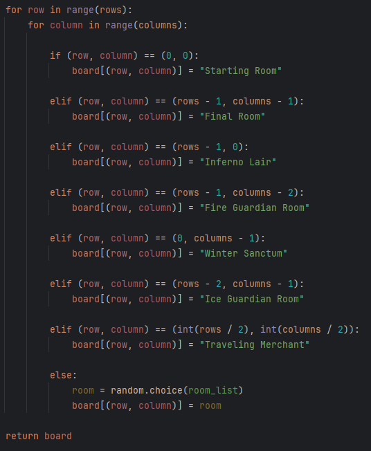 Creating a board using Tuples. make_board()                 |
| Mutable Data Structures   | 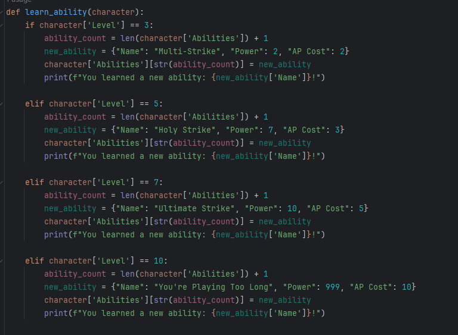 Adding new abilities to a Character's dictionary every level.   |
| Handling Exception Errors | 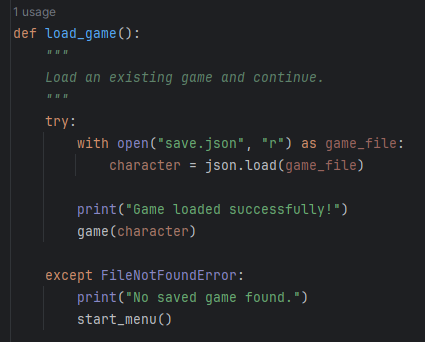 Try to open a load game.                                    |
| Minimized Scope, Objects  |  Events are saved in character, or inventory as specials.    |
| Atomic Functions          | 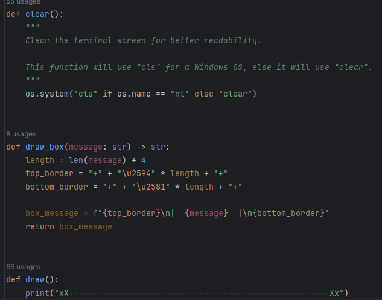 Functions in utility.py do one small job.                 |
| Simple Flat Code          | 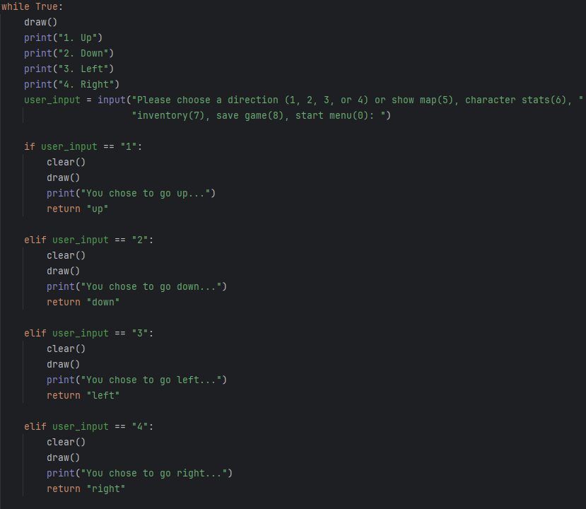 Example found in get_user_choice(). Very simple.          |
| Dictionary Comprehension  | 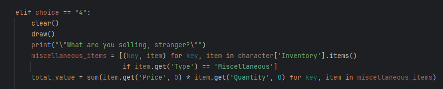 visit_shop() when selling miscellaneous items.            |
| if-elif-else Statements   |  get_user_choice() has many if-statements.                 |
| while-loop                | 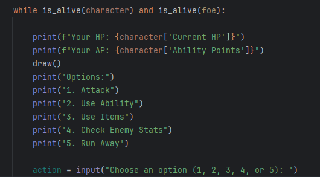 combat_loop() keeps player in a loop until win/lose.      |
| Membership Operator       | 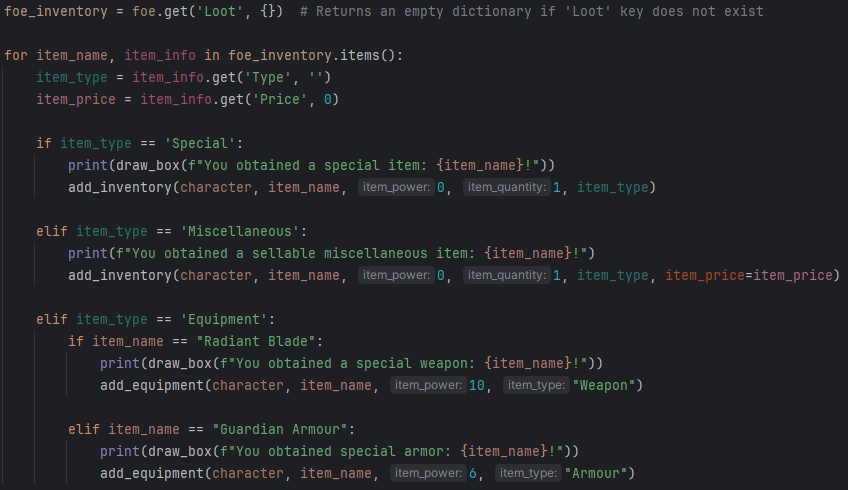 Checking for stuff **in** foe inventory. battle_rewards() |
| Range Function            |  Using range to make a map in make_board().                  |
| Itertools                 | 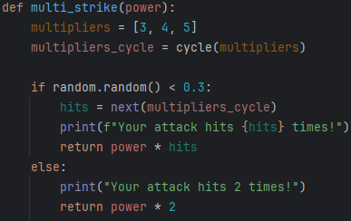 Cycle used to stream the next integer in the list.        |
| Random Module             |  Used to check for foes at a rate of 25%.                    |
| Function Annotations      |  draw_box() gets and string and outputs a string.          |
| Doctests & Unit Tests     | 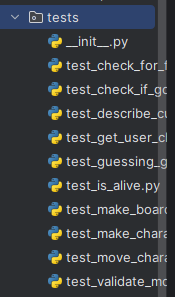 Unit tests found in tests folder. Doctests in functions.  |
| F-String Usage            | 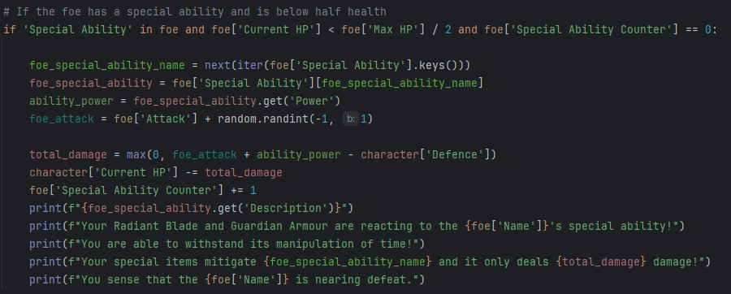 F-strings used in enemy_attack() for readability.         |

## Notes: